# NEURO:HΞAL — Migraine Tracker & Health Monitor

> A user-friendly gateway to your healthier lifestyle journey.

NeuroHeal is a React Native (Expo) mobile application that helps migraine sufferers track episodes, monitor health vitals, predict daily migraine risk, and receive AI-powered health insights — all in one place.

---
## 📱 Screenshots

| Splash                              | Login                               | Home                                | Migraine Tracking                   |
| ----------------------------------- | ----------------------------------- | ----------------------------------- | ----------------------------------- |
| 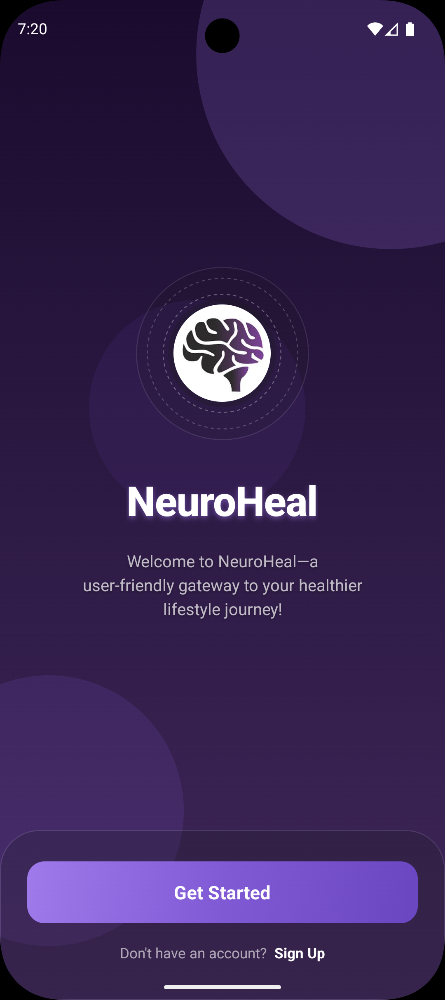 | 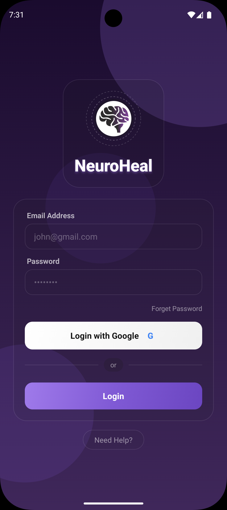 | 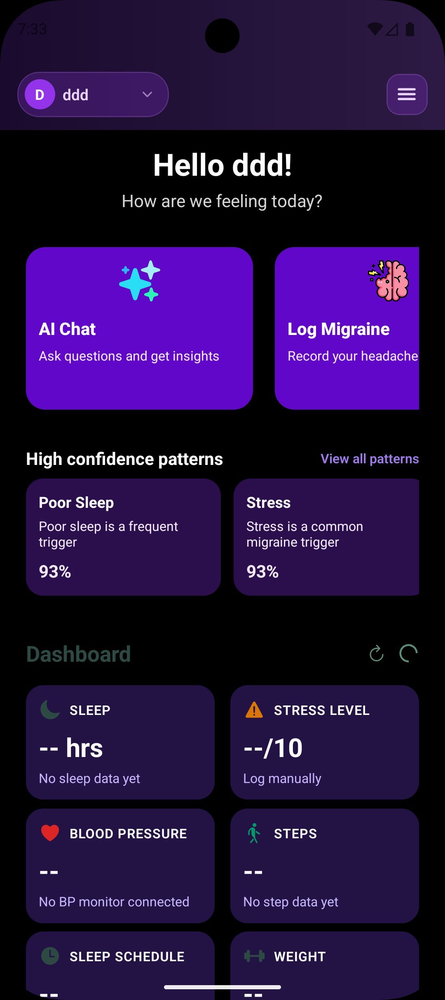 | 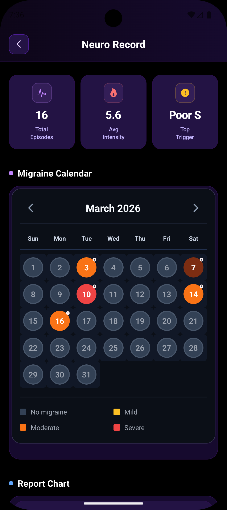 |


---

## ✨ Features

### 🔴 Migraine Tracking
- **Quick Log** — Log a migraine episode during or after an attack across 4 guided steps: intensity, symptoms, triggers & medication, and details
- **Migraine Calendar** — Visual calendar showing all logged episodes with severity colour coding
- **Neuro Record** — Combined view of the migraine calendar and report chart with summary stats (total episodes, avg intensity, top trigger)


| Classify                            | Neuro Record                        |
| ----------------------------------- | ----------------------------------- |
| 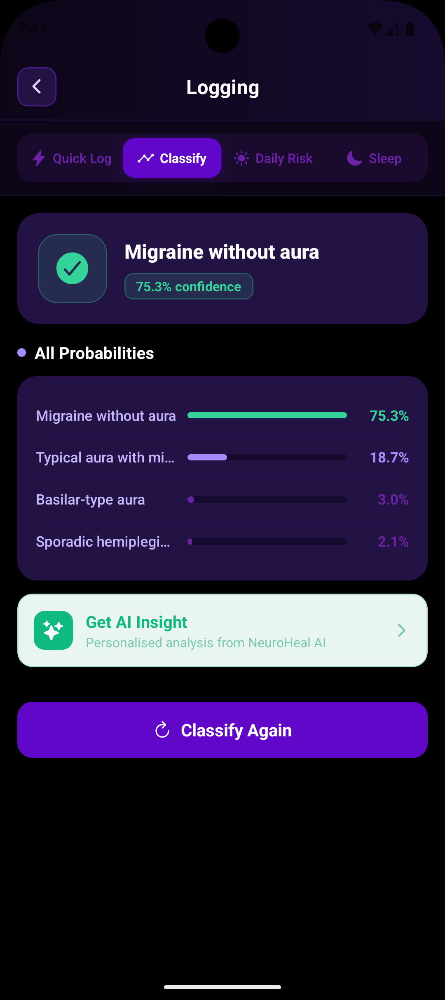 | 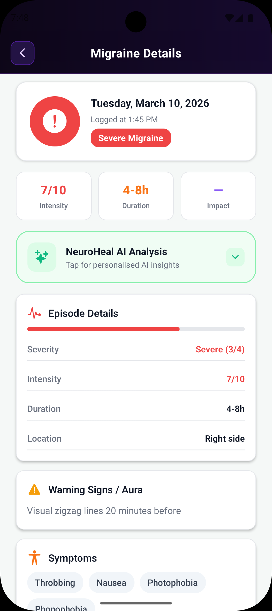 |


### 🤖 AI Features
- **NeuroRecord AI Chat** — Conversational AI health assistant powered by Claude; ask questions about your migraines, get insights, and track your journey
- **AI Health Analysis** — Full structured analysis of your migraine data including pattern assessment, risk factors, sleep connections, medication insights, and actionable recommendations
- **AI Insight Buttons** — Context-aware AI insights available on Sleep Assessment, Morning Risk Check, and Migraine Classification results


| AI chat                             | AI chat example                     |
| ----------------------------------- | ----------------------------------- |
| 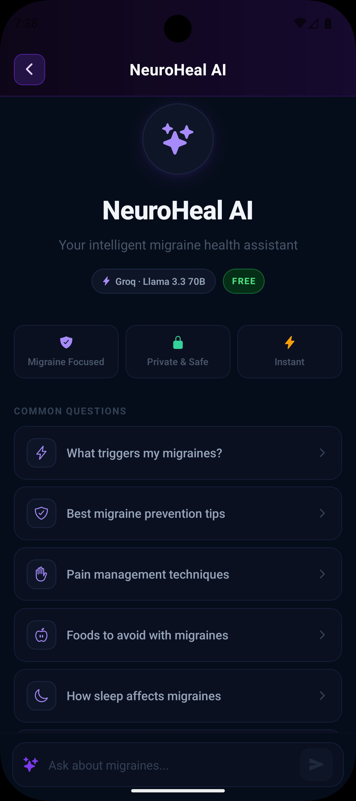 | 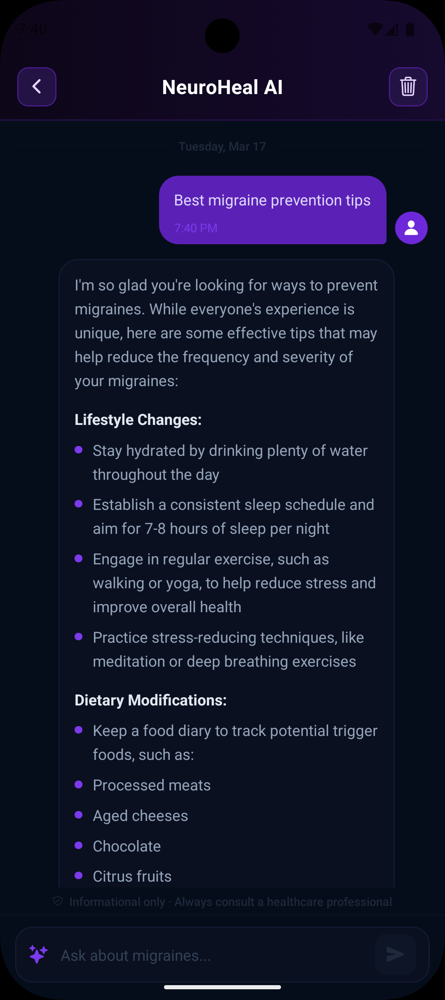 |


### 📊 Health Dashboard
- **Sleep** — Average sleep hours over the last 7 days
- **Blood Pressure** — Latest reading with status (Normal / Elevated / High)
- **Steps** — Total step count over the last 7 days
- **Weight** — Latest reading from connected scale
- **Sleep Schedule** — Average bedtime and wake time pattern
- **Stress Level** — Manual logging (coming soon)
- **Weather** — Real-time temperature and conditions with link to 5-day forecast

| Dashboard                           | Weather                              |
| ----------------------------------- | ------------------------------------ |
| 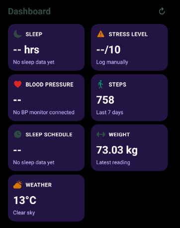 | 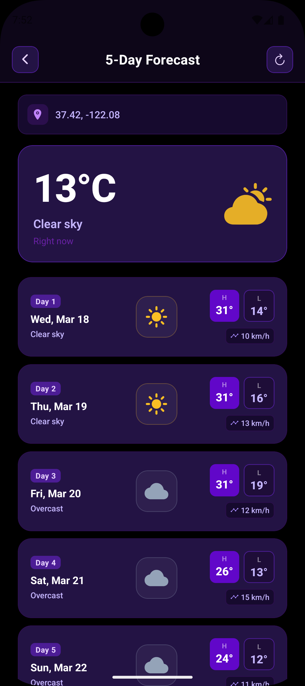 |


### 🩺 Clinical Tools (Logging Hub)

| Tab            | Description                                                                                                                               |
| -------------- | ----------------------------------------------------------------------------------------------------------------------------------------- |
| **Quick Log**  | 4-step episode logger for symptoms, triggers, medication, and notes                                                                       |
| **Classify**   | ML-powered migraine type classification (with aura, basilar, etc.) based on 20+ clinical symptoms                                         |
| **Daily Risk** | Morning risk check using sleep, stress, anxiety, hydration, and 15 environmental toggle triggers                                          |
| **Sleep**      | Sleep quality assessment comparing your REM %, deep sleep %, onset time, and total hours against migraine and healthy population averages |

### 🚨 Emergency
- SOS Emergency screen for rapid access during severe episodes
- Direct link from home screen quick tools row

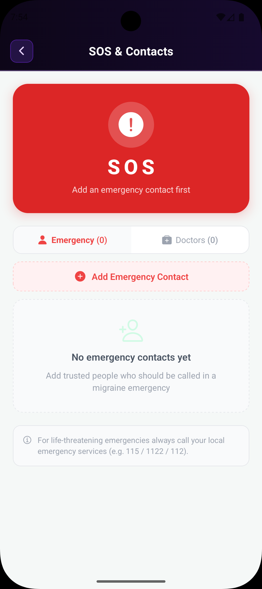

<br>


### 📄 Export & Reports
- Full PDF health report including vitals, severity breakdown, top triggers, symptoms, medications, and recent episodes
- Optional AI Health Analysis section embedded in the PDF
- Share via native share sheet on iOS and Android

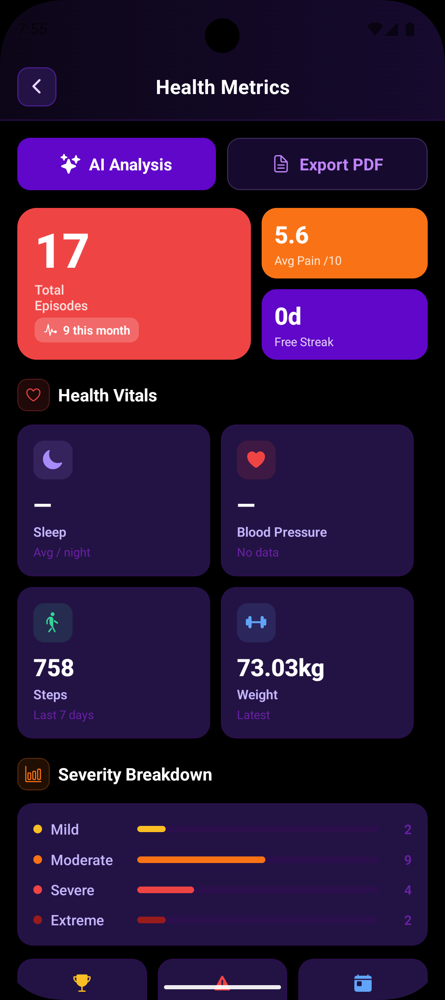

<br>


### 🔔 Pattern Warnings
- Automatic detection of high-confidence migraine trigger patterns (e.g. poor sleep, stress)
- Confidence percentage shown per pattern
- "View all patterns" link to the patterns screen

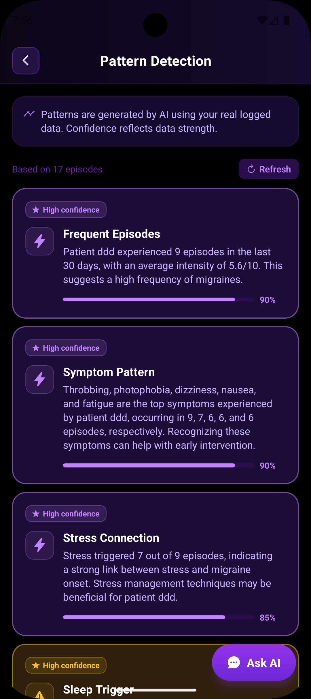

<br>


---

## 🏗 Tech Stack

| Layer       | Technology                                    |
| ----------- | --------------------------------------------- |
| Framework   | React Native + Expo (SDK 51+)                 |
| Navigation  | Expo Router (file-based)                      |
| Language    | TypeScript                                    |
| Styling     | React Native StyleSheet                       |
| Icons       | `@expo/vector-icons` (Ionicons)               |
| Gradients   | `expo-linear-gradient`                        |
| Blur        | `expo-blur`                                   |
| Location    | `expo-location`                               |
| PDF Export  | `expo-print` + `expo-sharing`                 |
| AI          | `groq`                                        |
| Weather API | Open-Meteo (free, no key needed)              |
| Backend     | Custom REST API (Python/FastAPI)              |
| State       | React Context (`UserContext`, `ThemeContext`) |

---

## 📁 Project Structure

```
app/
├── index.tsx                  # Splash + Login screen
├── _layout.tsx                # Root layout with providers
├── (tabs)/
│   └── index.tsx              # Home screen (dashboard)
├── ai-chat.tsx                # AI chat screen
├── patterns.tsx               # Pattern warnings screen
├── emergency.tsx              # SOS emergency screen
├── weather-forecast.tsx       # 5-day forecast
├── neuro-record.tsx           # Calendar + chart combined
├── export.tsx                 # Health metrics + PDF export
├── logging.tsx                # Logging hub entry point
└── menu.tsx                   # Floating menu

components/
├── NavigationBar.tsx          # Top nav with drawer menu + user profile
├── ModernHeader.tsx           # Back button header for sub-screens
├── MigraineCalendar.tsx       # Calendar component
├── MigraineReportChart.tsx    # Bar chart + daily breakdown
├── PatternWarnings.tsx        # Pattern alert cards
├── FloatingMenu.tsx           # Animated FAB menu
├── OnboardingScreen.tsx       # First-time setup flow
├── AIInsightButton.tsx        # Reusable AI insight trigger
└── quick-log/
    ├── index.tsx              # LoggingHub tab container
    ├── quick-log.tsx          # QuickLog component
    ├── detailed-classify.tsx  # DetailedClassify component
    ├── morning-check.tsx      # MorningCheck component
    └── sleep-log.tsx          # SleepLog component

contexts/
├── UserContext.tsx             # User data, name, integrations
└── ThemeContext.tsx            # Dark mode toggle

hooks/
└── useRealtimeMonitoring.ts   # Weather + step monitoring hook

services/
└── aiService.ts               # Claude API wrapper

config/
└── api.ts                     # Backend URL + endpoint constants
```

---

## 🚀 Getting Started

### Prerequisites

- Node.js 18+
- Expo CLI: `npm install -g expo-cli`
- iOS Simulator / Android Emulator or physical device with Expo Go

### Installation

```bash
# Clone the repository
git clone https://github.com/your-username/neuroheal.git
cd neuroheal

# Install dependencies
npm install

# Start the development server
npx expo start
```

### Backend Setup

The app requires a running backend server for health data, migraine episode storage, and ML predictions.

```bash
# In your backend directory
pip install -r requirements.txt
uvicorn main:app --host 0.0.0.0 --port 8080 --reload
```

Then update `BACKEND_URL` in `app/(tabs)/index.tsx` and `config/api.ts`:

```ts
// Android emulator
const BACKEND_URL = 'http://10.0.2.2:8080';

// iOS simulator
const BACKEND_URL = 'http://localhost:8080';

// Physical device — replace with your machine's local IP
const BACKEND_URL = 'http://192.168.X.X:8080';
```

### AI Setup

Add your Anthropic API key in `services/aiService.ts`:

```ts
const API_KEY = 'sk-ant-...';
```

---

## 🔌 Backend API Endpoints

| Method | Endpoint                              | Description                          |
| ------ | ------------------------------------- | ------------------------------------ |
| GET    | `/health/full?days=7`                 | Sleep, steps, blood pressure, weight |
| POST   | `/migraine-episodes`                  | Log a new episode                    |
| PUT    | `/migraine-episodes/:id`              | Update existing episode              |
| GET    | `/migraine-episodes/history?user_id=` | Fetch all episodes for a user        |
| POST   | `/sleep`                              | Sleep quality assessment             |
| POST   | `/migraine/today`                     | Daily migraine risk prediction       |
| POST   | `/symptom-type`                       | Migraine type classification         |

---

## 🎨 Design System

The app uses a consistent dark purple design language throughout:

| Token          | Value     | Usage                          |
| -------------- | --------- | ------------------------------ |
| Background     | `#000000` | Screen backgrounds             |
| Card           | `#231344` | All card surfaces              |
| Card Deep      | `#160a2e` | Input backgrounds, inner cards |
| Border         | `#2b0f4d` | All card borders               |
| Accent         | `#6107c9` | Primary buttons, active states |
| Text Primary   | `#ffffff` | Headings, values               |
| Text Secondary | `#c4b5fd` | Labels, subtitles              |
| Text Muted     | `#6b21a8` | Helper text, placeholders      |
| Green          | `#34d399` | Success, mild severity         |
| Amber          | `#fbbf24` | Warning, moderate severity     |
| Red            | `#f87171` | Danger, severe severity        |
| Indigo         | `#a78bfa` | Neurological symptoms          |
| Blue           | `#60a5fa` | Environmental triggers         |

---

## 📋 App Flow

```
App Launch
    └── Splash Screen
            └── Get Started → Login Screen
                    └── Login / Google → Home Screen
                            ├── AI Chat
                            ├── Quick Tools Row
                            │     ├── AI Chat
                            │     ├── Log Migraine → Logging Hub
                            │     │     ├── Quick Log
                            │     │     ├── Classify
                            │     │     ├── Daily Risk
                            │     │     └── Sleep
                            │     ├── Neuro Record → Calendar + Chart
                            │     └── SOS Emergency
                            ├── Pattern Warnings → Patterns Screen
                            ├── Dashboard Cards
                            │     └── Weather → 5-Day Forecast
                            └── Migraine Calendar

    Navigation Drawer (☰ menu)
            ├── Home
            ├── Log Migraine
            ├── Patterns
            ├── AI Chat
            ├── Calendar
            ├── Weather Forecast
            ├── Emergency
            ├── Export → Health Metrics + PDF
            └── Notifications
```

---

## 🔐 Permissions

| Permission             | Purpose                                                |
| ---------------------- | ------------------------------------------------------ |
| Location (When In Use) | GPS coordinates for weather data and reverse geocoding |

---

## 📦 Key Dependencies

```json
{
  "expo": "~51.0.0",
  "expo-router": "^3.0.0",
  "expo-linear-gradient": "^13.0.0",
  "expo-blur": "^13.0.0",
  "expo-location": "^17.0.0",
  "expo-print": "^13.0.0",
  "expo-sharing": "^12.0.0",
  "react-native-safe-area-context": "^4.0.0",
  "@expo/vector-icons": "^14.0.0"
}
```

---

## ⚠️ Medical Disclaimer

NeuroHeal is a personal health tracking tool designed to help users log and understand their migraine patterns. It is **not a medical device** and does not provide medical diagnoses. AI insights and risk predictions are informational only. Always consult a qualified healthcare professional for medical advice, diagnosis, or treatment.

---

## 👥 Contributing

1. Fork the repository
2. Create a feature branch: `git checkout -b feature/your-feature`
3. Commit your changes: `git commit -m 'Add your feature'`
4. Push to the branch: `git push origin feature/your-feature`
5. Open a Pull Request

---

## 📄 License

This project is licensed under the MIT License. See `LICENSE` for details.

---

## 🙏 Acknowledgements

- [Open-Meteo](https://open-meteo.com/) — Free weather API, no key required
- [Anthropic](https://anthropic.com/) — Claude AI powering health insights
- [Expo](https://expo.dev/) — React Native development framework
- [Ionicons](https://ionic.io/ionicons) — Icon library

---

*Built with ❤️ to help migraine sufferers understand and manage their condition.*